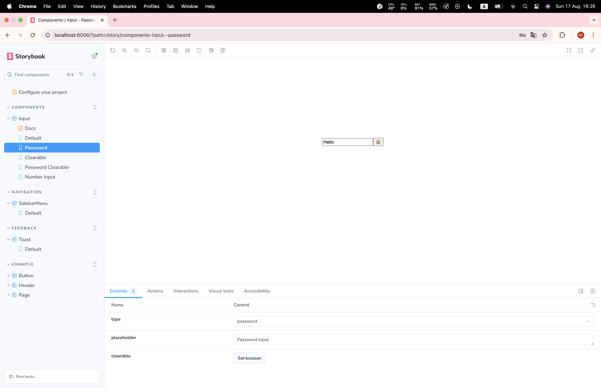
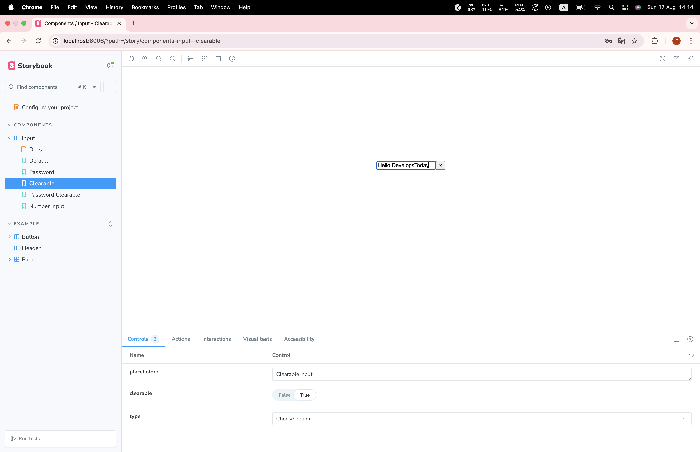

# React Component Library

This is a small component library built with React, TypeScript, and Storybook as part of a front-end assessment.

## Overview

The goal of this project is to create a reusable and well-documented set of UI components. The library includes:
- An advanced `Input` component
- A `Toast` notification system
- A nested `Sidebar Menu`

## Getting Started

### Prerequisites

- Node.js (v18 or higher)
- npm (v9 or higher)

### Installation & Setup

1.  **Clone the repository:**
    ```bash
    git clone <your-repo-url>
    cd react-component-library
    ```

2.  **Install dependencies:**
    ```bash
    npm install
    ```

3.  **Run Storybook:**
    This command will start the development server and open Storybook in your browser.
    ```bash
    npm run storybook
    ```
    You can view the components at `http://localhost:6006`.

## Components

Here is an overview of the components included in this library.

### 1. Input

A versatile `Input` component with the following features:
- Supports standard types (`text`, `password`, `number`).
- **Password Visibility Toggle:** Shows an eye icon to toggle text visibility when `type="password"`.
- **Clearable:** Shows an "X" icon to clear the input field when `clearable={true}`.

**Screenshots:**

| Default State | Password State (Visible) |
| :-----------: | :----------------------: |
|  |  |

| Clearable State (With Text) | Number State |
| :-------------------------: | :----------: |
|  |  |


### 2. Toast

A notification component that appears at the corner of the screen to provide feedback.
- Supports different types (`success`, `error`, `info`).
- Automatically dismisses after a configurable duration.
- Includes a fade/slide transition.

**Screenshots:**

| Success Toast | Error Toast | Info Toast  |
| :-----------: | :---------: | :---------: |
|  |  | 


### 3. Sidebar Menu

A collapsible navigation menu that slides in from the side.
- Supports nested menu items.
- Closes when the background overlay is clicked.

**Screenshots:**

| Closed State | Open State (2-level nesting) |
| :----------: | :--------------------------: |
|  |  | 


## Tech Stack

**Framework:** React
**Language:** TypeScript
**Build Tool:** Vite
**Component Workshop:** Storybook
**Styling:** SCSS
**Linting/Formatting:** ESLint + Prettier
